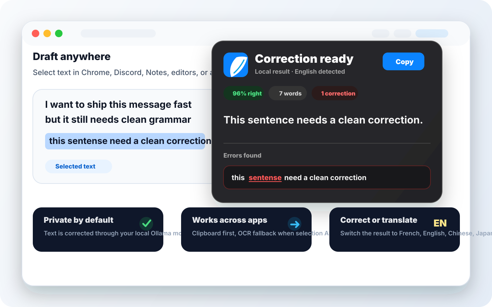
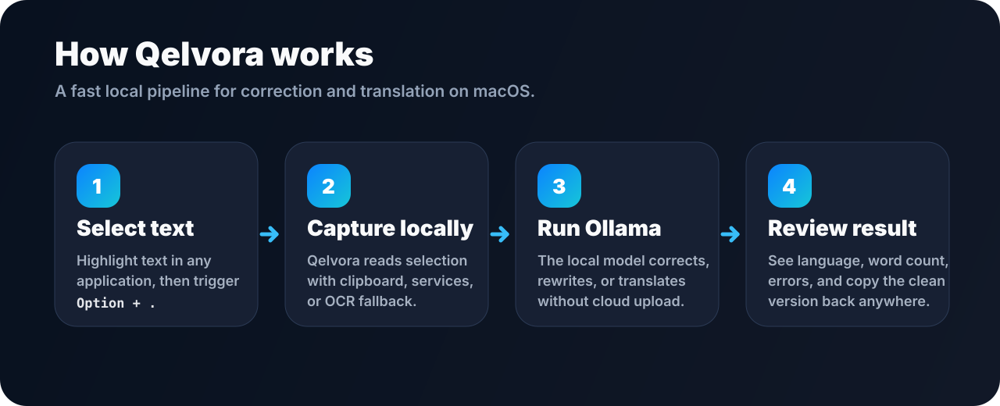
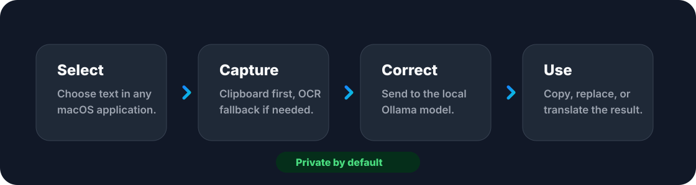

<p align="center">
  
</p>

<h1 align="center">Qelvora</h1>

<p align="center">
  Local-first writing correction and translation for macOS.
  <br>
  Select text anywhere, correct it locally, keep control of your words.
</p>

<p align="center">
  <a href="LICENSE"></a>
  
  
  
</p>

<p align="center">
  
</p>

## What It Does

Qelvora is a native macOS menu bar app that corrects spelling, grammar, and tone from selected text in other apps. It uses a local Ollama model, so the selected text stays on the user's Mac.

It is designed for writers, founders, builders, students, and anyone who wants a fast correction layer across browsers, chat apps, notes, and editors without sending drafts to a remote service.

## Why Qelvora

- **Local by design**: text is processed through the user's local Ollama instance.
- **Works across apps**: uses Accessibility, clipboard, and OCR fallbacks for difficult apps.
- **Correction and translation**: supports correction modes plus language switching from the result panel.
- **Flexible models**: recommended models are included, installed Ollama models are detected, and custom `model:tag` names are supported.
- **Open source**: the public repository is the source of truth.

## How It Works

<p align="center">
  
</p>

1. Select text in any macOS app.
2. Trigger Qelvora from the hotkey, the menu bar, or the macOS Services entry where available.
3. Qelvora captures the text locally using the best available method: Services, clipboard, Accessibility, or OCR fallback.
4. The selected Ollama model corrects or translates the text.
5. Review the result, detected source language, word count, highlighted issues, and copy the final version.

## Product Tour

| Surface | Purpose |
| --- | --- |
| Menu bar panel | Fast access to correction, writing mode, model selection, and updates |
| Result panel | Correction output, detected language, error highlights, word count, copy button, translation actions |
| Settings | Hotkey, macOS permissions, output style, model management, right-click service repair |
| OCR fallback | Handles apps that do not expose selected text through native selection APIs |

## Product Model

The code is open source and free to build.

The official DMG is the paid convenience build: signed, notarized, packaged, tested, and easier to install for non-technical users.

| Distribution | Audience | What it includes |
| --- | --- | --- |
| Source code | Developers | Full Swift/Xcode project under MIT |
| Official DMG | Users | Signed app, clean installer, support, updates |

## Workflow Preview

<p align="center">
  
</p>

## Requirements

- macOS 14 Sonoma or newer
- Xcode 15 or newer for source builds
- Ollama installed locally
- At least one Ollama model pulled locally
- Accessibility permission enabled for Qelvora
- Screen Recording permission enabled for OCR fallback in apps that do not expose selected text

Qelvora is intentionally not sandboxed. It needs Accessibility access to read and replace selected text across other applications.

## Quick Start

Install Ollama:

```sh
brew install ollama
```

Pull a small model:

```sh
ollama pull qwen2.5:3b
```

Build a local DMG:

```sh
./scripts/build-dmg.sh
```

Open the generated DMG from `dist/`, drag Qelvora to Applications, then grant the macOS permissions requested by the app.

## Models

Qelvora ships with a small recommended model catalog, but it is not locked to that list.

- Recommended models are shown first.
- Installed Ollama models are detected through `/api/tags`.
- Custom model names such as `llama3.1:8b` or `my-model:latest` can be selected manually.

This keeps the app useful as local models improve.

## Architecture

```text
Qelvora/
├─ App/                  App lifecycle and shared state
├─ UI/                   Menu bar UI, settings, result panel
├─ TextCapture/          Clipboard, Accessibility, OCR capture
├─ CorrectionEngine/     Correction and translation engine abstraction
├─ Models/               Recommended models, custom models, Ollama registry
├─ Hotkeys/              Global configurable hotkey
├─ Workflow/             End-to-end correction coordinator
└─ Resources/            Info.plist and app assets
```

The correction backend sits behind this protocol:

```swift
protocol CorrectionEngine {
    func correct(text: String, model: String, mode: CorrectionMode) async throws -> String
    func translate(text: String, model: String, targetLanguage: TranslationLanguage) async throws -> String
}
```

The current implementation is `OllamaEngine`.

## Development

Run tests:

```sh
xcodebuild test -project Qelvora.xcodeproj -scheme Qelvora -destination platform=macOS
```

Build the release DMG:

```sh
./scripts/build-dmg.sh
```

Generate the Sparkle appcast for in-app updates:

```sh
./scripts/generate-appcast.sh
```

By default, Qelvora checks `https://qelvora.app/appcast.xml`. Upload the generated `dist/appcast.xml` to that URL, and upload the matching DMG to GitHub Releases. The default appcast download prefix points to:

```text
https://github.com/CyrilDieumegard/Qelvora/releases/latest/download/
```

Set `MAXIMUM_VERSIONS=3 ./scripts/generate-appcast.sh` if you want the feed to keep older signed builds. The default keeps only the newest build so pre-Sparkle DMGs do not appear as unsigned update entries.

The Sparkle private signing key is stored in the macOS Keychain under the `qelvora` account. Do not export or commit it.

Distribution artifacts are ignored by Git:

```text
dist/
*.dmg
*.app
```

## Current Limits

- Ollama must already be installed and running.
- Recommended model downloads are delegated to the local Ollama API.
- Custom models must be available in Ollama before they can produce corrections.
- Some apps require OCR fallback because they do not expose selected text cleanly.
- Very large selections may take longer depending on the selected local model.

## Roadmap

- Signed and notarized public DMG release.
- Public Sparkle appcast hosted at `qelvora.app/appcast.xml`.
- Better onboarding for Ollama and macOS permissions.
- Model health checks before correction.
- More compatibility tests for browsers, Discord, Slack, editors, and office apps.
- Optional updater and changelog page for the official build.

## License

Qelvora is released under the [MIT License](LICENSE).
